make sure the things below.
```shell
1.your machine has a nvidia gpu.
```

run the shell below. if you have virtualenv
```shell
bash create_env.sh
```

then
```shell
bash run
```

it could work

output
square size: 1-500  repeats: 1000  


1000_1_500  
acceleration  

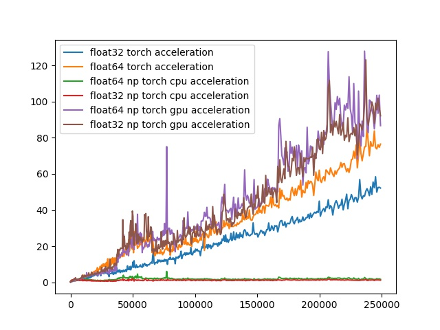

take time  
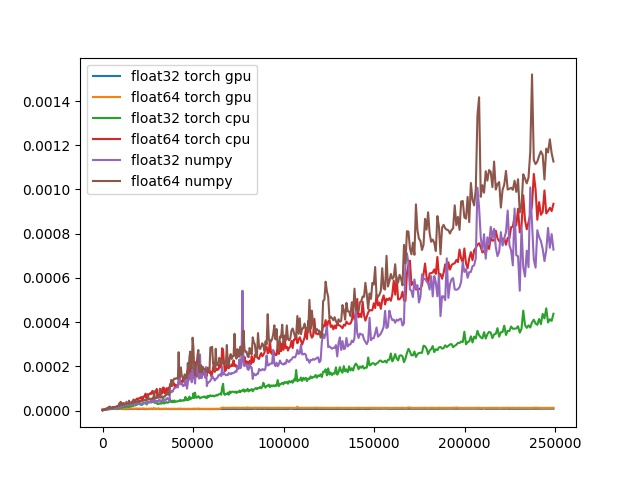


5_500_3000  

acceleration  

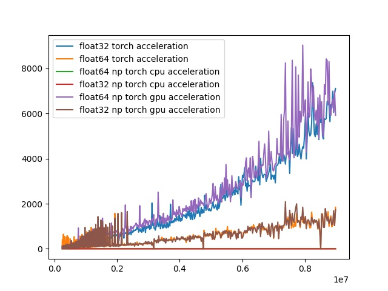

take time  
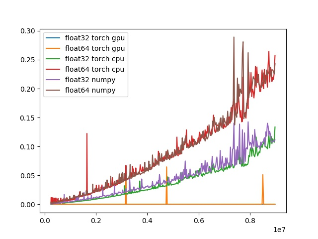

1_1_10000  

acceleration  

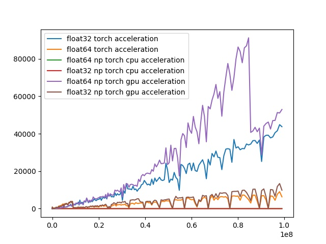

take time  
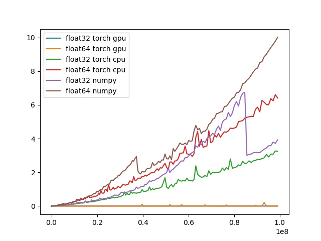


1000_1_100

acceleration  

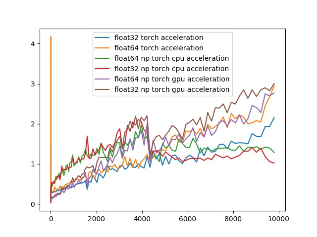

take time  
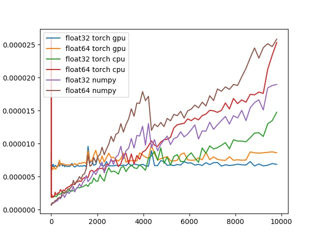

1000_101_200

acceleration  

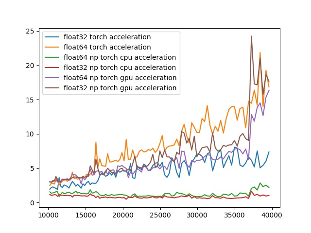

take time  
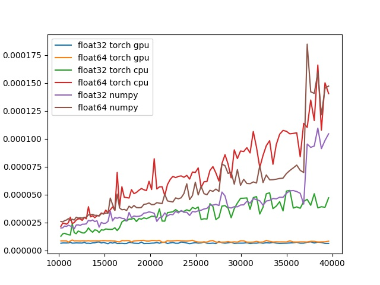

1000_201_300

acceleration  

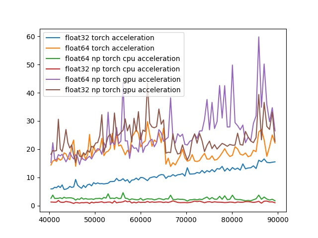

take time  
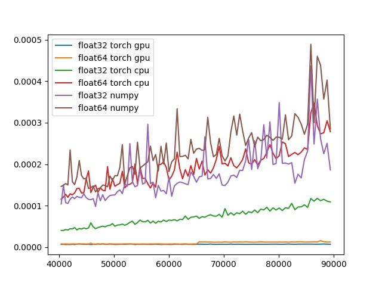

1000_301_400

acceleration  

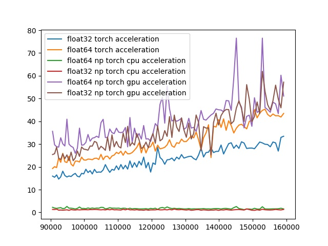

take time  
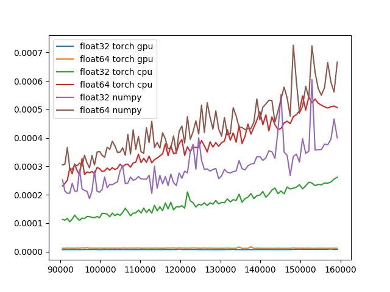

1000_401_500

acceleration  

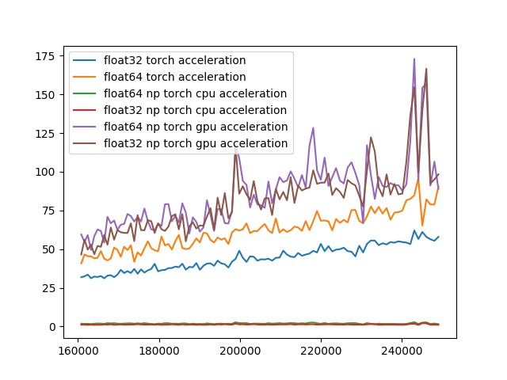

take time  
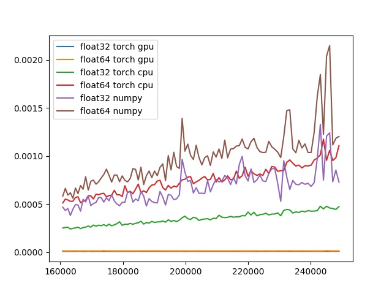
